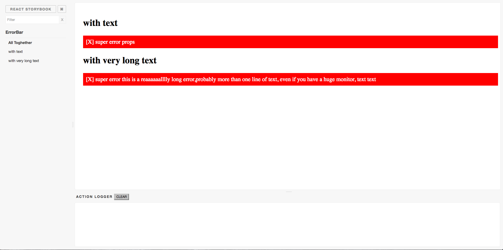

# React Storybook Info Addon

A React Storybook addon to show additional information for your stories.



### Usage

Install the following npm module:

```sh
npm i --save @kadira/react-storybook-addon-info
```


```js

import { configure,setAddon } from '@kadira/storybook';
import addStoriesGroup from 'UTILITY_PATH'

setAddon(addStoriesGroup)

function loadStories() {
  require('../src/components/stories/MyComp');
  // require as many stories as you need.
}

configure(loadStories, module);
```

Then create your stories with the `.addWithInfo` API.

```js
import { action , storiesOf} from '@kadira/storybook';
import MyComp from '../MyComp';

const stories = [
  {
    name:"with text" ,
    props: {text:"super error props", resetErrorMessage: action('clicked!') }
  },
  {
    name:"with very long text",
    props: {text:"super error this is a reaaaaaalllly long error, probably more than one line of text, even if you have a huge monitor, text text", resetErrorMessage: action('clicked!') }
  }
]

storiesOf('MyComp', module)
  .addStoriesGroup(MyComp, stories)
```

> Have a look at [this example](example/story.js) stories to learn more about the `addWithInfo` API.
